# Projet AL2000 - *Novembre 2022*
## Description globale de l'état du code
### Cahier des charges
* Le cahier des charges de départ se situe dans la SRS rédigée (res/Documents/SRS_GL_Projet_M1_Info.pdf)
* Toutes les fonctionnalités ne sont pas présentes, et certaines ont été modifiées
### Avancée
* Dire où on en est, ce qui marche, et ce qui marche pas
* etc
## Comment compiler et exécuter le projet ?
### Etape 1 : se connecter au VPN
- Lancer le VPN Cisco fourni par l'UGA
### Etape 2 (optionnelle) : peupler la BD
- Lancer les scripts : *destruction_base.sql*, *creation_base.sql* et *peupler_base.sql* sur le serveur Oracle (c.f. Session)
Attention : Session permet une connexion à la base par l'utilisateur davidge (mdp : 365214), le peuplement de la base doit donc se faire aussi sur ce schéma.
### Etape 3 : compiler et créer le Jar (*IntelliJ*, optionnel)
#### Il est possible de recréer le jar (remplacer *AL2000.jar*) :
* Aller dans "Project Structure..." -> "Artifacts"
* Ajouter ("+") -> JAR -> "From modules with dependencies"
* Choisir la classe **Main()** et cocher **Extract to the target JAR**
* Pour le générer faire ensuite "Build" -> "Build Artifacts..."
Le .JAR est alors généré dans le dossier du projet
### Etape 4 : exécuter le programme
* Avoir une version de java supérieure à 17
* Lancer la commande *java -jar AL2000.jar* dans le répertoire contenant le fichier

## Liste des tests des parties fonctionnelles

## Diagramme UML de la partie métier 

```puml
@startuml

package GestionMachine {
class Machine
class Technicien
interface Distributeur
interface Maintenance
class Inventaire
class Statistiques
class Signalement
}

package GestionClient {
class Client
class Abonné
class CB
class CarteAbo
class Anonyme
class Carte
class Compte
}

package GestionLocation {
class Location
class HistoLoc
class Film
class BluRay
interface Support
class Catalogue
class Panier
class Genre
class FiltreTri
class Police
class Etat
class "QR Code"

}

AL2000 "0..1" --> "1" Compte : interagit
AL2000 "1" -l-> "1" Panier : possède
AL2000 "1" --> "1" HistoLoc : consulte
AL2000 "1" --> "1" Catalogue : consulte
AL2000 "1" --> "1" Signalement: interagit
AL2000 "1" -r-> "1" Distributeur : opère
AL2000 "1" -r-> "0..1" Technicien : authentifie

Technicien "1" --> "1" Maintenance : opère

Machine "1" --> "1" Statistiques : met à jour
Machine "1" -r-> "1" Inventaire : met à jour
Machine .u.|> Distributeur
Machine .u.|> Maintenance


Compte "0..*" --> "1" Client : associe

Panier "1" --> "0..*" Location : contient

HistoLoc "1" <-- "1" Police : analyse

Catalogue "*" --> "1" FiltreTri : utilise

Client "1" --> "1" Carte : possède
Client "*" -r-> "*" Genre : interdit
Client <|-- Abonné
Client <|-- Anonyme

Carte <|-- CB
Carte <|-- CarteAbo

Location "0..*" --> "1" Support : contient
Location "0..*" --o "1" Client
Location .. Etat

Support "1..*" --> "1" Film : possède
Support <|-- "QR Code"
Support <|-- "BluRay"

class AL2000 {
- initialisation()
+ louerFilms()
+ rendreFilms()
+ donnerCatalogue(f: FiltreTri) : Liste<FilmFormat>
+ inscription(f:Formulaire)
+ connexion(mdp:String)
+ connexionTechnicien()
+ deconnexion()
+ ajouterPanier(s:Support)
+ changerSupportPanier(l:Location)
+ consulterPanier() : Liste<Location>
+ validerPanier()
+ voirHistoMachine() : Liste<Location>
+ voirHistoClient() : Liste<Location>
+ voirStatistiques() : Statistiques
+ ouvrirMachine()
+ fermerMachine()
+ recharger(m:float)
+ retirerSolde(cb: CB)
+ signalerProblème(f:FormulaireSignalement)
+ réglerInterdits(li: Liste<Genre>)
  }


class Compte {
+ inscrire(f: FormulaireInscription)
+ connexion(c: CarteAbo, mdp: String)
+ deconnexion()
+ vérifier_fonds(m: float) : bool
+ rechargerSolde(montant: float, cb: CB)
+ retirerSolde(cb: CB)
+ réglerInterdits(L: Liste<Genre>)
+ AnonymeSetCB(cb: CB)

}

abstract class Client {
+ payer(s: Support, nbJours: int)
+ payerRetard(s: Support)
+ recharger(montant: float)
+ fondsReserves(h: HistoLoc): float
+ réglerInterdits(L: Liste<Genre>)
+ payerMax()
  }

class Abonné {
+ nom: String
+ prenom : String
+ adresseMail : String
+ adressePostale : String
  }

class Panier {
+ ajouter(s: Support, c: Client)
+ supprimer(s: Support)
+ changerSupport(l:Location)
+ verifier() : bool
+ viderPanier()
+ evaluerPrix()
  }

class Catalogue {
liste_films : List<Films>
inv : Inventaire
+ donnerFilms(a:Abonné, f:FiltreTri) : Liste<Films,bool>
- récupérerPréférences(a:Abonné) : Préférences
- récupérerFilmsBD() : Liste<Films>
  }

class Signalement {
+ envoyer(FormulaireSignalement)
  }
  note "Un signalement envoyé à CyberVidéo" as A2
  Signalement .. A2

class Machine {
}

class HistoLoc {
+ voirHistorique() : Liste<Location>
+ voirHistoriqueClient(a:Abonne) : Liste<Location>
+ voirLocationEnCours(a:Abonne) : Liste<Location>
+ ajouterLocations(l:Liste<Location>)
+ rendreBluRay(b:BluRay)
  }

class Technicien {
id : int
nom : String
prenom : String
histo : HistoLoc
+ voirHistorique() : Liste<Location>
+ ouvrirMachine()
+ fermerMachine()
+ voirStatistiques() : Statistiques
+ donnerInventaire() : Inventaire
  }

interface Distributeur {
+ lireCB(infosCarte:String) : CB
+ lireCarteAbo(id:String) : CarteAbo
+ lireCTechnicien(id:String) : Technicien
+ livrerFilms(liste_films:Liste<Support>)
+ livrerBluRay(b:BluRay)
+ imprimerQRCode(qr:QRCode)
+ avalerBluRays()
+ chercherBluRay(Film f)
  }

interface Maintenance {
+ ouvrir()
+ fermer()
+ voirStatistiques() : Statistiques
+ donnerInventaire() : Inventaire
  }


class Inventaire {
- liste_BluRays : Liste<BluRay>
+ initialiser()
+ ajouterBluRay()
+ supprimerBluRay(b:BluRay)
  }

class Statistiques {
nbLocations : int
nbOuvertures : int
}

class Location {
- dateLocatin: Date
- etatLocation: Etat
+ payer()
+ payerRetard()
+ changerSupport(dist: Distributeur)
+ {Static} fondsNecessaire(l: location, promo: bool)
+ {Static} fondsNecessaire(L: Liste<location>, promo: bool)
  }

abstract class Carte {
- id: int
+ payer(montant: float)
+ recharger(montant: float)
+ verifier_fonds(m: float): bool
  }

class CB {
- informationBanquaires: String
  }

class CarteAbo {
- solde: float
  }

abstract class Support {
-id: int
-prixMax: float
-prixAboJour: float
-prixBaseJour: float
+ supportInverse(d:Distributeur)
+ sortirFilm(d:Distributeur)
  }

class "QR Code" {

}

class BluRay {

}

class Film {
-titre: String
-date: String
-réalisateur: String
-durée: String
-genre: Genre
}

class Police {
- t:Timer
+ CheckPaiements()
  ##TODO
  }

note "Vérifie périodiquement s'il y a des locations\non rendues depuis plus de 5 jours" as A1
Police .l. A1

enum Etat {
ENCOURS
APAYER
TERMINEE
}

enum Genre {
WESTERN
ACTION
FANTAISIE
ANIME
HORREUR
SF
SUSPENSE
ROMANCE
COMEDIE
}

class FiltreTri {
+ t:Tri
+ valeur:String
  }

@enduml
```

