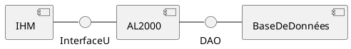

# Projet AL2000 - *Novembre 2022*
## Conventions de code
- Commentaires et code en français
- Javadoc pour toutes les classes avec nom(s) de(s) auteur(s)

## Comment se connecter à la base de données ?
- Activer le VPN (CISCO)
- Modifier la classe BaseDeDonnees.Session:
```java
public class Session {
    public void open() {
        String url = "jdbc:oracle:thin:@localhost:1521:im2ag";
        String user = "davidge"; // Ici mettre l'identifiant AGALAN
        System.out.println("Session : Connexion à la base de données à " + url + " par " + user);
        try {
            DriverManager.registerDriver(new oracle.jdbc.OracleDriver());
            String passwd = "97c7fa9f41"; // Ici mettre le mot de passe Oracle
            // (dans le fichier oracle.txt)
            connect = DriverManager.getConnection(url, user, passwd);
            System.out.println("Session : Connecté");
        } catch (SQLException e) {
            System.out.println("Session : Connexion impossible");
            e.printStackTrace();
        }
    }
}
```
- Lancer dans un terminal la commande "ssh -N -L 1521:im2ag-oracle.univ-grenoble-alpes.fr:1521 LOGIN@im2ag-oracle.univ-grenoble-alpes.fr" avec l'identifiant AGALAN

## Comment créer la base de données et la peupler ?
- Lancer le script "creation_base.sql" puis "peupler_base.sql"

## Structure générale


## Comment écrire de la doc java ?
Un exemple :
```java
/**
* Début de commentaire spécifique à la javadoc. On
* commence par une description générale de la classe.
* Le texte peut être enrichi de balises html :
* <ul>
* <li>pour créer des listes ;</li>
* <li>pour <tt>mettre en valeur</tt> du texte.</li>
* </ul>
*
* @author meta-information
* @version spécifique au module
*/
class Point {
    /** Abscisse */
    private double x;
    /** Ordonnée */
    private double y;
    /**
     * Description de la méthode, ici un recupérateur.
     * @return valeur de l'abscisse.
     */
    double x() {
        return x;
    }
    /**
     * Et ici un modificateur.
     * @param x nouvelle abscisse
     * @param y nouvelle ordonnée
     */
    void setXY(double x, double y) {
        this.x = x;
        this.y = y;
    }
}
```
